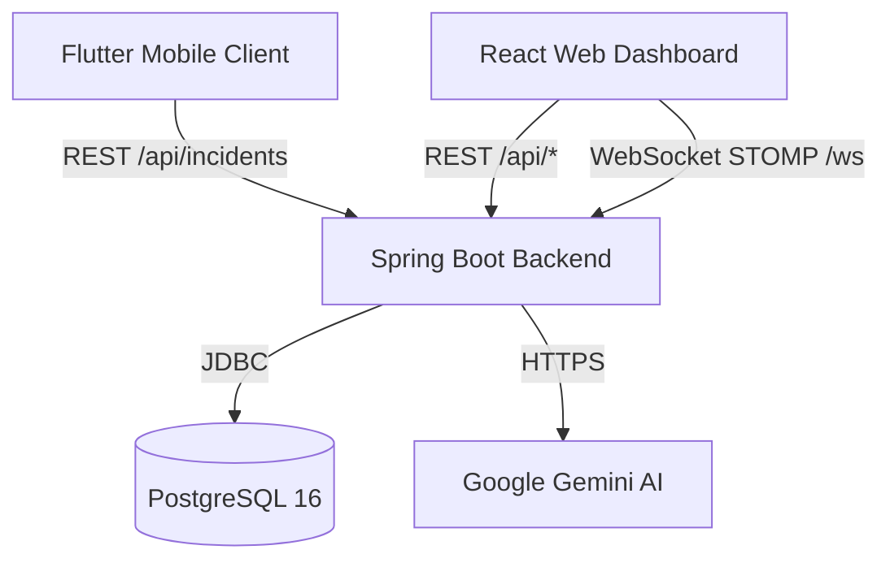

# 🚀 MobAlert Production Deployment Guide

This guide covers deployment instructions for **MobAlert** across all components:
1. **Spring Boot Backend** (REST APIs + STOMP WebSockets + DBSCAN + Gemini AI)
2. **React Admin Dashboard** (Vite + TypeScript + Leaflet Heatmap)
3. **Flutter Mobile Application** (Android APK / iOS)
4. **PostgreSQL Database**

---

## 🏗️ Architecture Overview



---

## ⚡ Option 1: 1-Click Docker Compose (VPS / Self-Hosted)

Recommended for VPS servers (DigitalOcean Droplet, AWS EC2, Hetzner, Linode, etc.).

### 1. Prerequisites
- Docker Engine & Docker Compose installed.
- Open ports `80`, `443`, `8080` (if direct), and `5432` (internal).

### 2. Setup
```bash
# Clone the repository
git clone https://github.com/your-org/Mob-Alert.git
cd Mob-Alert

# Configure environment
cp .env.example .env
nano .env   # Update POSTGRES_PASSWORD, GEMINI_API_KEY, and domain origins
```

### 3. Build & Run
```bash
docker compose up -d --build
```

### 4. Verify
- **Frontend**: `http://<your-server-ip>:3000`
- **Backend Health**: `http://<your-server-ip>:8080/actuator/health`
- **Backend Metrics**: `http://<your-server-ip>:8080/api/admin/metrics`

---

## ☁️ Option 2: Cloud Managed Deployment (Recommended for Scalability & Free Tier)

### 1. Database (Neon / Supabase / Render Postgres)
1. Create a PostgreSQL 15/16 database instance on [Neon](https://neon.tech) or [Supabase](https://supabase.com).
2. Note the JDBC connection string, user, password, and port.

---

### 2. Spring Boot Backend (Render / Railway / Fly.io)

#### Deploying on Render / Railway:
1. Connect your GitHub repository.
2. Set **Root Directory**: `MobAlert - Backend`.
3. Set **Runtime**: `Docker` (Render will detect the `Dockerfile`) or `Java 21`.
4. Configure the following **Environment Variables**:
   | Variable | Example Value | Note |
   |---|---|---|
   | `PORT` | `8080` | Render assigns this dynamically |
   | `DB_URL` | `jdbc:postgresql://<neon-host>:5432/<db>?sslmode=require` | JDBC Postgres URL |
   | `PGUSER` | `neon_user` | Database user |
   | `PGPASSWORD` | `neon_password` | Database password |
   | `GEMINI_API_KEY` | `AIzaSy...` | Your Google Gemini API Key |
   | `ALLOWED_ORIGINS` | `https://your-dashboard.pages.dev,https://yourdomain.com` | Allowed CORS origins (comma-separated) |
   | `SPRING_JPA_HIBERNATE_DDL_AUTO` | `update` | Auto-create tables on launch |
   | `SHOW_SQL` | `false` | Keep logs clean |

5. **Health Check Endpoint**: `/actuator/health`

---

### 3. React Frontend (Cloudflare Pages / Vercel / Netlify)

#### Deploying on Cloudflare Pages:
1. Connect your repository to **Cloudflare Pages**.
2. Set **Root directory**: `MobAlert - Frontend`.
3. Set **Framework preset**: `Vite`.
4. Set **Build command**: `npm run build`.
5. Set **Build output directory**: `dist`.
6. Add **Environment Variables**:
   - `VITE_API_BASE_URL`: `https://your-backend.onrender.com/api`
   - `VITE_WS_BASE_URL`: `https://your-backend.onrender.com/ws`
7. Click **Save and Deploy**. (The included `public/_redirects` file guarantees direct URL refreshes work seamlessly).

---

## 📱 Mobile App (Flutter APK Release)

To build a production Android APK pointing to your live backend:

```bash
cd "MobAlert - Application"

# Get dependencies
flutter pub get


# Build Release APK with production backend URL
flutter build apk --release --dart-define=API_BASE_URL=https://your-backend.onrender.com
```

Output APK will be available at:
`build/app/outputs/flutter-apk/app-release.apk`

---

## 🛡️ Production Checklist

- [x] **CORS Configuration**: Restrict `ALLOWED_ORIGINS` to your production frontend URLs.
- [x] **Database Passwords**: Ensure strong passwords and use SSL (`sslmode=require` on cloud Postgres).
- [x] **Gemini API Key**: Never hardcode your API key; supply it via `GEMINI_API_KEY` environment variable.
- [x] **SPA Routing**: `public/_redirects` and `nginx.conf` handle client-side route fallback.
- [x] **Health Checks**: `/actuator/health` configured for container auto-recovery and monitoring.
